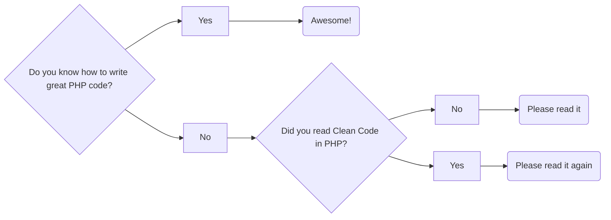

# Controle Financeiro

Mais um sistema de finanças pessoais


## Setup ambiente 

1. Instalar autoenv **Siga as orientações: https://github.com/hyperupcall/autoenv**

```
# with cURL
curl -#fLo- 'https://raw.githubusercontent.com/hyperupcall/autoenv/master/scripts/install.sh' | sh
```

2. Crie o ambiente virtual

```
python -m venv .venv

```

```
cp .env.example .env

```
Obs: Caso seu virtualenv tenha outro nome, altere para o nome correto no arquivo .env


## Ferramentas

- ASDF
- [autoenv](https://jay.gooby.org/2023/06/13/asdf-python-and-automatically-enabling-virtual-envshttps://jay.gooby.org/2023/06/13/asdf-python-and-automatically-enabling-virtual-envs)


## teste mermaid


